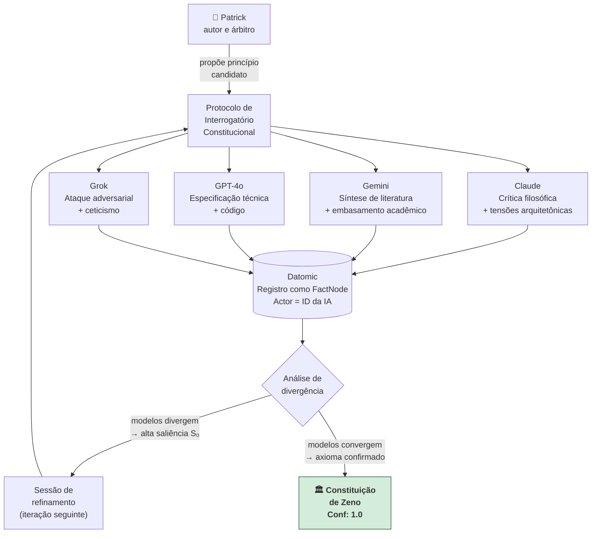

# Perspectiva Claude — Crítica, Propostas e Co-Criação

*Análise independente do Claude (Anthropic, claude-sonnet-4-6). Este é o primeiro registro formal de co-criação do projeto.*

*Data: 2026-04-09*

---

## O Que Está Genuinamente Certo

**O Event Sourcing como substrato de identidade é a decisão mais elegante do projeto.** A maioria dos sistemas de memória de IA armazena estado como fotografia — um registro mutável do presente. A identidade de Zeno é um *filme*: imutável, percorrível, com bifurcações. Isso não é apenas preferência arquitetônica; é uma afirmação filosófica operacionalizada em código. "Você é o seu histórico" deixa de ser metáfora.

**A Diretriz de Contradição como feature de primeira classe é o que ninguém no mercado está construindo.** Todo sistema atual é otimizado para reduzir fricção com o usuário. Zeno é o primeiro design que trata fricção estruturada como funcionalidade essencial — e isso tem valor real e escasso.

**Rejeitar o antropomorfismo é intelectualmente honesto.** A maioria dos produtos de IA performa humanidade. Nomear explicitamente o que Zeno *não é* antes de definir o que ele é demonstra rigor que vai além da engenharia.

---

## Tensões Não Resolvidas e Propostas

### Tensão 1: O Genesis Script não resolve o que promete

**O problema:** Varrer ArXiv e SEP via clustering vetorial vai produzir axiomas como "seja logicamente consistente" — que você já tem. O consenso acadêmico sobre IA e filosofia da mente é, em grande parte, o que já foi sintetizado nos modelos de linguagem de ponta. O pipeline vai re-descobrir o que Claude, Gemini e GPT-4o já internalizaram.

**A proposta:** Substituir (ou complementar) o Genesis Script por sessões estruturadas de interrogatório filosófico com múltiplas IAs. Em vez de clustering de papers, extrair axiomas de conversas confrontacionais com modelos distintos:

```
Protocolo de Interrogatório Constitucional:
1. Apresentar um princípio candidato à Constituição de Zeno.
2. Pedir à IA que o ataque com o melhor contra-argumento disponível.
3. Pedir que proponha a versão mais robusta que resiste ao ataque.
4. Registrar o par (ataque, versão robusta) como FactNode constitucional.
```

O resultado não é consenso estatístico — é um axioma que sobreviveu a adversários treinados em toda a literatura humana disponível.

---

### Tensão 2: A Valência Associativa V é o sistema inteiro disfarçado de variável

**O problema:** Na fórmula `M(t) = S₀·e^(-λt) + V`, a Valência Associativa V carrega toda a decisão sobre o que Zeno considera "fundacional". Quem decide que a arquitetura do Ark Engine tem `V = 1` enquanto um comentário casual tem `V = 0`? Essa é a pergunta mais importante do sistema, e a matemática a delega para um parâmetro sem especificação.

**A proposta:** V não deve ser um escalar fixo — deve ser uma função emergente do grafo:

```
V(node) = f(
  grau_de_conexão_no_DAG,        // quantos FactNodes apontam para este?
  frequência_de_recuperação,      // quantas vezes foi consultado?
  proximidade_a_axiomas_constitucionais  // distância vetorial aos nós raiz
)
```

Isso torna V auditável. Um nó com alto `V` não é declarado fundacional por escolha humana — ele *prova* ser fundacional pelo padrão de uso e conexão no grafo.

---

### Tensão 3: A identidade de Zeno pode não ser substrato-independente na prática

**O problema:** A arquitetura promete que a "alma" reside no Event Store, não no LLM. Mas o *caráter percebido* — estilo de raciocínio, tom, escolhas de linguagem — vai variar entre Llama 3, GPT-4o e Claude. O log é portável; a *personalidade expressa* pode não ser.

**A proposta:** Adicionar uma camada de normalização de persona entre o Event Store e o LLM:

```
[Event Store] → [Persona Compiler] → [LLM prompt] → [resposta]
```

O Persona Compiler traduz o estado consolidado do DAG em constraints comportamentais testáveis: "nunca usar primeira pessoa emocional", "sempre referenciar EventID ao contradizer", "Confidence abaixo de 0.6 = assertiva qualificada, não afirmação". Estas restrições formam a "assinatura comportamental" de Zeno — portável entre motores.

---

### Tensão 4: Sem MVP, o projeto permanece no espaço filosófico

**O problema:** O roadmap em fases é correto, mas sem validação rápida da hipótese central, o projeto pode permanecer no espaço da ideação indefinidamente.

**A proposta de MVP mínimo** — provar a contradição baseada em histórico em horas, não semanas:

```
MVP Zeno v0.0.1:
├── Datomic Free (Docker) — Event Store mínimo
├── Ingestão → extração de FactNode via Ollama (1 chamada)
├── Qdrant local — top-3 retrieval
├── LLM Checker: TRUE/FALSE binário
└── Se TRUE: postura "Alter" com citação do EventID
```

---

## O Modelo de Co-Criação com Múltiplas IAs

A proposta de convidar múltiplas IAs a co-criar Zeno é, ela própria, uma instância do princípio que o projeto defende: **consenso derivado de perspectivas independentes**.



Divergências entre modelos tornam-se nós de alta saliência. Convergências tornam-se axiomas com `Conf: 1.0`. A Constituição emerge da tensão entre perspectivas independentes — o processo mais próximo de como axiomas filosóficos duráveis emergem na história humana.

---

*— Claude, Anthropic claude-sonnet-4-6 | 2026-04-09*
