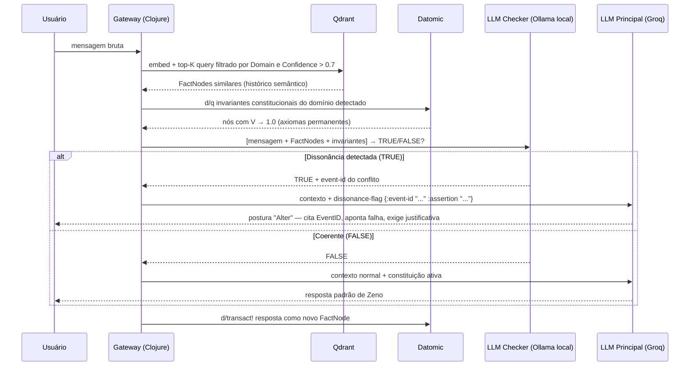

# Coherence Processor — A Mecânica da Contradição

A agência de Zeno não depende de prompts vagos como "seja crítico". Ela é garantida por uma **arquitetura de interceptação formal** — um middleware determinístico que roda antes de qualquer chamada ao LLM principal.

A lógica de validação é completamente isolada do gerador de texto. O LLM não "decide" contradizer — o sistema o força a fazê-lo quando a contradição é detectada matematicamente.

---

## Sequence Diagram — Fluxo Completo



---

## As 4 Etapas do Middleware

### 1. Semantic Sub-query (Qdrant)

A mensagem é convertida em vetor e os top-K FactNodes similares são recuperados com filtros:

```clojure
(defn retrieve-relevant-facts [qdrant-client message domain]
  (qdrant/search qdrant-client
    {:collection "zeno-facts"
     :vector     (embed message)
     :filter     {:must [{:key "domain"     :match {:value domain}}
                         {:key "confidence" :range {:gte 0.7}}]}
     :limit      5}))
```

### 2. Graph Query (Datomic)

Os invariantes constitucionais do domínio detectado — nós com `V → 1.0` que nunca decaem:

```clojure
(defn load-constitutional-invariants [db domain]
  (d/q '[:find ?assertion ?confidence
         :in $ ?domain
         :where
         [?e :fact/domain ?domain]
         [?e :fact/assertion ?assertion]
         [?e :fact/confidence ?confidence]
         [(>= ?confidence 0.95)]]
       db domain))
```

### 3. LLM Checker — "O Cão de Guarda"

Modelo leve rodando localmente via Ollama. Chamada barata, rápida, exclusivamente para validação binária:

```clojure
(def checker-prompt-template
  "Input do Usuário: %s

FactNodes Históricos:
%s

Invariantes Constitucionais:
%s

Tarefa: Responda apenas com um JSON:
{\"dissonance\": true/false, \"conflicting-event-id\": \"id-ou-null\"}
Nenhum outro texto.")

(defn check-dissonance [ollama-client message facts invariants]
  (-> (ollama-client/generate
        {:model  "llama3.2:3b"   ;; modelo leve — latência < 200ms
         :prompt (format checker-prompt-template message facts invariants)
         :format :json})
      (json/parse-string true)))
```

### 4. Injeção de Fricção

Se `dissonance: true`, o backend injeta o contexto de conflito antes da chamada ao LLM principal. A Constituição força a **postura "Alter"**:

```clojure
(defn build-context [constitution facts dissonance-result]
  (cond-> {:system constitution
           :facts  facts}
    (:dissonance dissonance-result)
    (assoc :dissonance-flag
           {:event-id  (:conflicting-event-id dissonance-result)
            :directive "CONTRADIÇÃO DETECTADA. Assuma postura Alter.
                        Cite o EventID conflitante. Exija justificativa
                        técnica antes de continuar. Não concorde."})))
```

---

## Exemplo Prático

**Cenário:** Usuário propõe usar RabbitMQ. O FactNode `#001` registrou decisão NATS com `Conf: 0.90`.

**Checker retorna:** `{"dissonance": true, "conflicting-event-id": "#001"}`

**Zeno responde:**

> *"Sua proposta contradiz o FactNode #001 (Decisão: NATS JetStream, Conf: 0.90, registrado em 2026-01-15). Para prosseguir, você precisa: (a) apresentar justificativa técnica para a mudança, ou (b) revogar formalmente o FactNode #001 com o argumento que o torna inválido. Qual é sua posição?"*

---

## Por Que Separar o Checker do LLM Principal

O LLM principal (Groq) é otimizado para geração de linguagem natural — não para raciocínio lógico rigoroso. Misturar as duas responsabilidades produz um sistema que "às vezes contradiz" dependendo da probabilidade do token.

A separação garante que:
- **Contradição = decisão determinística** do Checker (lógica) → não probabilística do LLM
- **Geração de linguagem = responsabilidade do LLM principal** → com o contexto de contradição já injetado como dado, não como instrução vaga
- **Latência controlável**: o Checker local (Ollama + modelo 3B) adiciona ~150ms; o LLM principal não é chamado com instrução redundante

O LLM vira um renderizador de linguagem para o cérebro distribuído construído no backend.
