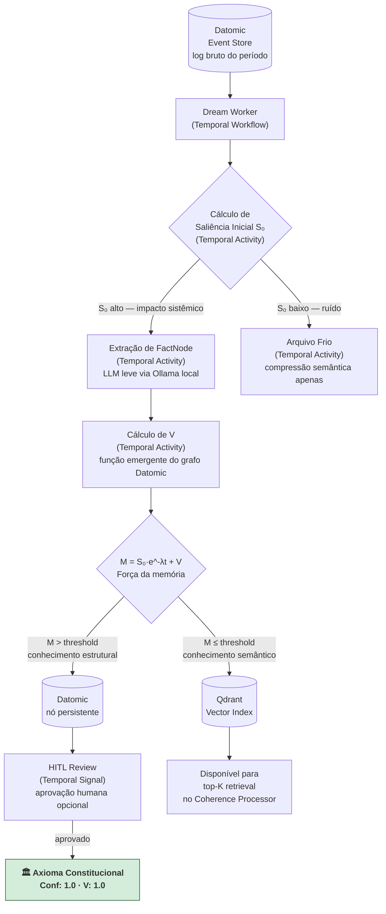

# Dream Worker — Pipeline ETL e Engine de Saliência

Zeno não processa o banco de dados inteiro a cada mensagem. Ele utiliza um pipeline assíncrono de *ETL de Contexto* executado durante períodos de ociosidade — o "Ciclo do Sonho".

O Dream Worker é implementado com **Temporal.io** — orquestrador de workflows duráveis que garante exactly-once semantics, retry automático e histórico de execução auditável. É o estado da arte para pipelines de AI multi-etapa, e a escolha direta para quem usa Temporal em produção.

---

## Fluxo ETL



---

## Por Que Temporal

| Critério | Alternativa descartada | Temporal |
| :---- | :---- | :---- |
| **Maturidade** | Onyx (deprecated desde ~2019) | Amplamente adotado em produção, suporte ativo |
| **Durabilidade** | core.async (in-process, sem persistência) | Workflows sobrevivem a restarts do processo |
| **Retry semantics** | Implementação manual | Retry policies configuráveis por Activity |
| **Observabilidade** | Logs externos | UI nativa com histórico de execução, timelines |
| **Exatamente-once** | Difícil de garantir sem infraestrutura própria | Garantido pela engine do Temporal Server |
| **Ecosistema Clojure** | — | SDK via `io.github.manetu/temporal-clojure-sdk` |

---

## Implementação em Clojure

O SDK Clojure para Temporal (`temporal-clojure-sdk`) é um wrapper sobre o SDK Java que expõe macros idiomáticas.

### Definição do Workflow

```clojure
(ns zeno.dream-worker.workflow
  (:require [temporal.workflow :refer [defworkflow]]
            [temporal.activity :refer [invoke]]
            [zeno.dream-worker.activities :as act]))

(defworkflow dream-worker-workflow
  [{:keys [period-start period-end]}]
  (let [events   (invoke act/ingest-events
                         {:period-start period-start :period-end period-end}
                         {:start-to-close-timeout (java.time.Duration/ofMinutes 10)})

        scored   (invoke act/calculate-salience
                         {:events events}
                         {:start-to-close-timeout (java.time.Duration/ofMinutes 5)})

        facts    (invoke act/extract-facts
                         {:high-salience (:high scored)}
                         {:start-to-close-timeout (java.time.Duration/ofMinutes 15)
                          :retry-options {:maximum-attempts 3}})

        _        (invoke act/archive-cold
                         {:low-salience (:low scored)}
                         {:start-to-close-timeout (java.time.Duration/ofMinutes 5)})

        valued   (invoke act/calculate-valence
                         {:facts facts}
                         {:start-to-close-timeout (java.time.Duration/ofMinutes 5)})

        _        (invoke act/route-and-persist
                         {:valued-facts valued}
                         {:start-to-close-timeout (java.time.Duration/ofMinutes 10)})]
    {:status :completed :facts-processed (count facts)}))
```

### Definição das Activities

```clojure
(ns zeno.dream-worker.activities
  (:require [temporal.activity :refer [defactivity]]
            [zeno.store.datomic :as db]
            [zeno.llm.ollama :as ollama]
            [zeno.store.qdrant :as qdrant]))

(defactivity ingest-events [{:keys [period-start period-end]}]
  (db/fetch-events-between period-start period-end))

(defactivity calculate-salience [{:keys [events]}]
  (let [score (fn [e] (assoc e :salience (compute-salience e)))]
    (group-by #(if (> (:salience %) 0.5) :high :low)
              (map score events))))

(defactivity extract-facts [{:keys [high-salience]}]
  ;; LLM local via Ollama — sem custo de API, sem dependência de nuvem
  (ollama/extract-facts high-salience {:model "llama3.2:3b"}))

(defactivity calculate-valence [{:keys [facts]}]
  (map #(assoc % :valence (db/compute-graph-valence %)) facts))

(defactivity route-and-persist [{:keys [valued-facts]}]
  (doseq [fact valued-facts]
    (if (> (:valence fact) 0.7)
      (db/transact! fact)           ;; Datomic — conhecimento estrutural
      (qdrant/upsert! fact))))      ;; Qdrant — conhecimento semântico
```

### Worker Process

```clojure
(ns zeno.dream-worker.worker
  (:require [temporal.client.worker :as worker]
            [zeno.dream-worker.workflow :as wf]
            [zeno.dream-worker.activities :as act]))

(defn start-worker! []
  (worker/start!
    {:task-queue "dream-worker"
     :workflows  [wf/dream-worker-workflow]
     :activities [act/ingest-events
                  act/calculate-salience
                  act/extract-facts
                  act/archive-cold
                  act/calculate-valence
                  act/route-and-persist]}))
```

---

## Etapas do Pipeline

### 1. Ingestão

Leitura do log bruto via query Datomic temporal:

```clojure
(defn fetch-events-between [db period-start period-end]
  (d/q '[:find [(pull ?e [*]) ...]
         :in $ ?start ?end
         :where
         [?e :fact/tx-time ?t]
         [(>= ?t ?start)]
         [(<= ?t ?end)]]
       db period-start period-end))
```

### 2. Compressão Semântica

Colapso de conversas em "Axiomas" e "Insights" por modelo local (Ollama) — sem custo de API:

```clojure
(defn extract-facts [events {:keys [model]}]
  (ollama/generate
    {:model  model
     :prompt (str "Extraia os fatos técnicos essenciais como JSON:\n" (pr-str events))
     :format :json}))
```

### 3. Engine de Saliência — A Matemática da Retenção

```
M(t) = S₀ · e^(-λt) + V
```

| Variável | Significado | Cálculo |
| :---- | :---- | :---- |
| **M(t)** | Força da memória no tempo t | Determina roteamento: Datomic (estrutural) vs Qdrant (semântico) |
| **S₀** | Saliência inicial | Impacto sistêmico do evento — decisão arquitetural = alto; comentário casual = baixo |
| **λ** | Taxa de decaimento | Reduzida a cada recuperação pelo Coherence Processor |
| **V** | Valência Associativa | Função emergente do grafo — não escalar fixo (ver abaixo) |

### 4. Valência como Função de Grafo

```clojure
(defn compute-graph-valence [db node-id]
  (let [in-degree    (count-incoming-refs db node-id)
        retrievals   (count-retrievals db node-id)
        const-dist   (distance-to-constitution db node-id)]
    (/ (+ (* 0.4 in-degree)
          (* 0.4 retrievals)
          (* 0.2 (- 1.0 const-dist)))
       3.0)))
```

Nós constitucionais têm `V → 1.0` — a memória forma uma assíntota e nunca decai a zero.

---

## Scheduling

O Dream Worker é agendado como um Temporal Schedule (cron-like, mas durável):

```clojure
(temporal.client.schedule/create-schedule!
  {:schedule-id "dream-worker-nightly"
   :spec        {:cron-expressions ["0 3 * * *"]}  ;; 3am diariamente
   :action      {:workflow     dream-worker-workflow
                 :task-queue   "dream-worker"
                 :input        {:period-start :yesterday
                                :period-end   :now}}})
```
