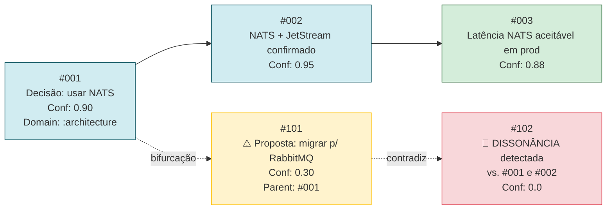

# Event Store — Datomic, XTDB e o Modelo FactNode

A alma de Zeno é o seu Event Store. Esta é a decisão arquitetônica mais importante do projeto: ela determina se a imutabilidade é uma *convenção* (frágil) ou uma *garantia do sistema* (irrevogável).

---

## Por Que Não PostgreSQL

**PostgreSQL com append-only é uma convenção.** Nada impede tecnicamente um `UPDATE` ou `DELETE` — depende de disciplina humana. Em produção sob pressão, isso quebra. Basta um engenheiro cansado, um script de migração mal testado, ou uma decisão de "só desta vez".

A identidade de Zeno não pode depender de disciplina humana.

---

## Datomic vs XTDB

| | **Datomic** | **XTDB** |
| :---- | :---- | :---- |
| **Licença** | Comercial (Cognitect/Nubank) | Open-source (MIT) |
| **Modelo** | Datoms imutáveis: `[entity attribute value tx]` | Bitemporal: `transaction-time` + `valid-time` |
| **Queries** | Datalog nativo | Datalog + SQL |
| **Self-hosted** | Datomic Free / Datomic Cloud | Sim, total |
| **Ponto forte** | Filosofia Rich Hickey: o banco como valor imutável. Integração nativa com Clojure. | Dois eixos de tempo independentes — separação entre "quando o fato ocorreu" e "quando foi registrado" |
| **Recomendação** | **Primário** — Patrick tem experiência de produção | Alternativa para soberania total sem licença |

**O bitemporal do XTDB** é especialmente poderoso: permite consultar *"o que Zeno sabia sobre X em 15 de março, usando apenas fatos registrados até essa data"*. Isso é auditabilidade histórica que nenhum CRUD pode oferecer.

**Datomic é o primário** porque Patrick já tem produção com ele. Não é aprendizado — é aplicação direta de uma especialidade existente.

---

## O Átomo de Estado: FactNode

A "alma" de Zeno é seu Event Store. Nenhum dado é atualizado (UPDATE) ou deletado (DELETE). O estado da personalidade é uma função pura do histórico:

```
f(Histórico) = Estado
```

Cada interação é um evento em um Grafo Direcionado Acíclico (DAG):

```clojure
;; Schema Datomic
[{:db/ident       :fact/event-id
  :db/valueType   :db.type/string
  :db/cardinality :db.cardinality/one
  :db/unique      :db.unique/identity
  :db/doc         "Hash SHA-256 do conteúdo + timestamp"}

 {:db/ident       :fact/actor
  :db/valueType   :db.type/string
  :db/cardinality :db.cardinality/one
  :db/doc         "Patrick, Zeno, ou ID da IA co-criadora"}

 {:db/ident       :fact/domain
  :db/valueType   :db.type/keyword
  :db/cardinality :db.cardinality/one
  :db/doc         ":architecture, :personal-preference, :constitution, :ark-engine"}

 {:db/ident       :fact/assertion
  :db/valueType   :db.type/string
  :db/cardinality :db.cardinality/one
  :db/doc         "A verdade imutável extraída"}

 {:db/ident       :fact/confidence
  :db/valueType   :db.type/double
  :db/cardinality :db.cardinality/one
  :db/doc         "Pontuação do Dream Worker (0.0 a 1.0)"}

 {:db/ident       :fact/parent-event
  :db/valueType   :db.type/ref
  :db/cardinality :db.cardinality/one
  :db/doc         "Referência ao FactNode anterior no DAG — cria bifurcação"}

 {:db/ident       :fact/valid-time
  :db/valueType   :db.type/instant
  :db/cardinality :db.cardinality/one
  :db/doc         "Quando o fato se tornou verdade no mundo real"}]
```

> O campo `:fact/parent-event` é a chave da imutabilidade funcional. O `tx-time` é gerenciado automaticamente pelo Datomic em cada transação.

---

## O Mecanismo de Bifurcação no DAG

Quando o usuário muda de ideia sobre uma decisão técnica, o evento novo **não apaga o antigo** — ele aponta para o hash do antigo e cria uma **bifurcação de estado**.

É dessa linhagem de ponteiros que Zeno extrai sua capacidade de contradizer: percorre o grafo e detecta quando uma afirmação atual diverge de um FactNode com `Confidence` alta no passado.



---

## Soberania do LLM

A inteligência real de Zeno reside no Event Store proprietário. O LLM é tratado como um *Side Effect* puro — um motor de linguagem descartável e substituível:

```clojure
;; O LLM não conhece o histórico. Ele recebe apenas o contexto compilado:
(defn render-response [compiled-context llm-engine]
  (llm-engine/generate compiled-context))

;; O contexto é derivado do Event Store — nunca armazenado no LLM:
(defn compile-context [db constitution recent-facts]
  {:system-prompt   constitution
   :relevant-facts  recent-facts
   :dissonance-flag (detect-dissonance db recent-facts)})
```

Se o `llm-engine` mudar de Groq para Ollama para Claude, o histórico de Zeno permanece intacto.
