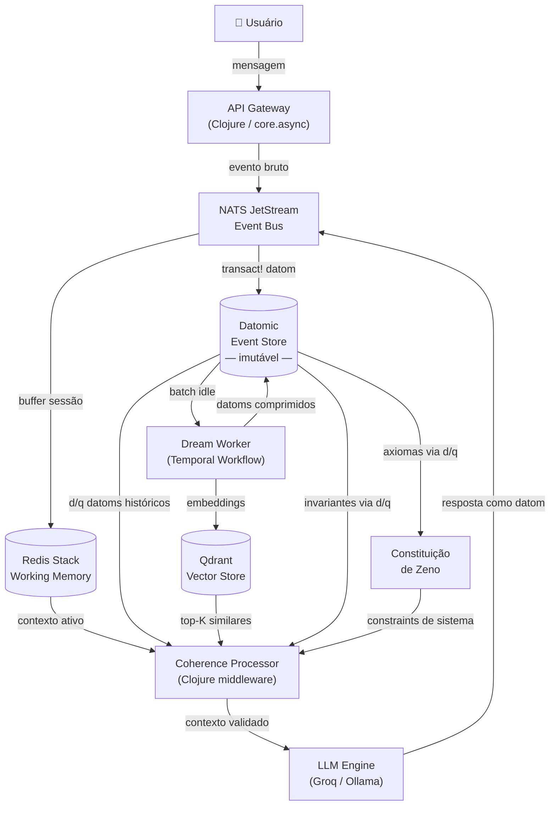

# Arquitetura Geral — Stack e Diagrama do Sistema

## Stack Tecnológica

| Função Cognitiva | Equivalente na Engenharia | Stack | Justificativa |
| :---- | :---- | :---- | :---- |
| **Córtex Sensorial** | Ingestão de eventos em tempo real | **Clojure** (core.async) + **NATS JetStream** | core.async oferece CSP nativo (channels, go blocks). NATS JetStream para persistência e at-least-once delivery. Patrick tem produção com ambos. |
| **Memória de Trabalho** | Buffer ativo da sessão | **Redis Stack** (RedisJSON + RediSearch) | Busca semântica e filtros JSON na mesma camada de cache — elimina hop de rede. |
| **Lobo Frontal** | Raciocínio e geração de linguagem | **Groq** (API) + **Ollama** (local) | Groq para latência mínima em produção; Ollama para soberania total com Llama 3.3 70B. Integração via Clojure com hato/clj-http. |
| **Hipocampo** | Consolidação e compressão de memória | **Temporal.io** + SDK Clojure (`temporal-clojure-sdk`) | Estado da arte para orquestração de workflows duráveis. Exactly-once semantics, retry automático, UI de observabilidade nativa. A mesma stack que a vaga Scalable Systems usa. |
| **Córtex Cerebral (Semântico)** | Índice vetorial de longo prazo | **Qdrant** | Rust, self-hosted, payload filtering nativo por `Domain`/`Confidence`. Já no CV de Patrick. |
| **Córtex Cerebral (Estrutural)** | Knowledge Graph — relações e invariantes | **Datomic** (entities/attributes) | O modelo `[entity attribute value tx]` já é um grafo de fatos imutáveis. Patrick tem produção com Datomic. Elimina dependência extra de graph DB separado. |
| **Amígdala** | Valência e saliência | Engine de Saliência em **Clojure puro** | `(defn valence [node graph] ...)` — função pura, testável, sem side effects. Executada como Temporal Activity dentro do Dream Worker. |
| **Event Store — A Alma** | Log imutável, fonte única da verdade | **Datomic** (primário) / **XTDB** (open-source) | Ver [event-store.md](event-store.md). Datomic é primário dado o histórico de produção de Patrick. |

---

## Diagrama Geral do Sistema



---

## Princípio Fundamental da Separação de Responsabilidades

```
[Identidade]   → Datomic Event Store    — imutável, portável, soberano
[Memória]      → Qdrant Vector Store    — semântico, indexado, recuperável
[Raciocínio]   → LLM Engine             — descartável, substituível, stateless
[Coerência]    → Coherence Processor    — middleware determinístico, sem LLM
[Consolidação] → Temporal Dream Worker      — assíncrono, exactly-once, auditável
```

O LLM é deliberadamente a camada mais fraca e substituível. A identidade de Zeno não reside nos pesos do modelo — reside no Event Store. Se o provedor de inferência mudar, Zeno continua sendo Zeno.

---

## Leituras Relacionadas

- [event-store.md](event-store.md) — Datomic, XTDB, FactNode e o modelo DAG
- [dream-worker.md](dream-worker.md) — Pipeline ETL e Engine de Saliência
- [coherence-processor.md](coherence-processor.md) — Mecanismo de contradição
