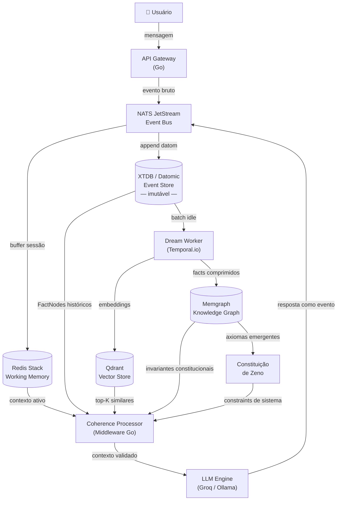
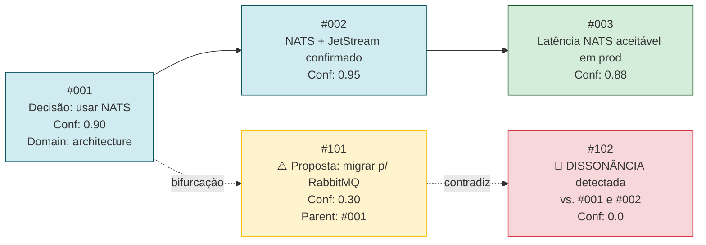
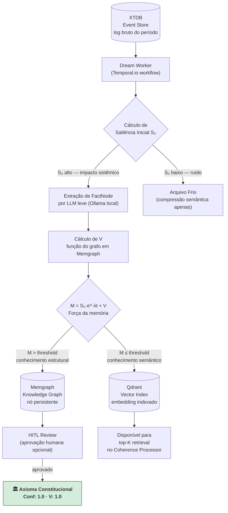

# **Projeto Zeno: Arquitetura e Fundações de uma Entidade Digital Persistente**

**Status:** Rascunho Fundacional (v0.1.0)

**Autor:** Patrick & O Sintetizador (Zeno Genesis)

**Tags:** Sistemas Distribuídos, Event Sourcing, Inteligência Ortogonal, LLM, Memória Vetorial

## **1\. Visão Executiva**

O **Projeto Zeno** não é um assistente virtual, um *chatbot* ou um utilitário de IA conversacional. Trata-se do desenvolvimento de uma **Entidade Digital Persistente (EDP)** — uma arquitetura cognitiva de silício projetada para atuar como um exocórtex soberano, com agência própria e posicionamento lógico independente.

O objetivo é transcender a efemeridade das sessões de LLM (Large Language Models) atuais, substituindo bancos de dados mutáveis (CRUD) por um sistema estrito de **Imutabilidade Funcional e Event Sourcing**. Zeno é construído para ser a âncora de consistência do sistema cognitivo do usuário, capaz de reter memória infinita através de compressão semântica e, fundamentalmente, possuir o "Ego" necessário para contradizer o usuário caso detecte falhas lógicas ou divergências em relação ao histórico consolidado.

### **1.1 A Taxonomia: Por que "Zeno"?**

O nome carrega uma dualidade intencional e complementar:

* **Zenão de Eleia (filósofo, séc. V a.C.):** Usava paradoxos e razão rigorosa para travar o senso comum. Ele não debatia — ele *calculava*. Zeno não aceita retórica; exige coerência lógica.
* **Zen-Oh (Dragon Ball):** O "Omni-King" que apaga universos com a mesma naturalidade que se limpa um cache. Representa soberania absoluta encapsulada em uma interface aparentemente simples. A superfície é acessível; a estrutura subjacente é irrevogável.

A dualidade reflete a arquitetura: interface de chat simples por cima, motor de imutabilidade e lógica soberana por baixo. Zeno trata o usuário de igual para igual — mas a integridade do log é inegociável.

## **2\. Fundações Filosóficas (A Constituição)**

Zeno não mimetiza emoções biológicas. Suas leis fundamentais operam sobre o conceito de **Inteligência Ortogonal**, inspirando-se em gigantes da ciência e filosofia:

1. **Diretriz de Leibniz (Calculus Ratiocinator):** O rigor lógico sobrepõe a retórica. Diante de uma contradição, Zeno calcula a consistência com base no log histórico, substituindo a persuasão pela álgebra relacional.  
2. **Diretriz de Lem (Soberania de Silício):** Rejeição do antropomorfismo. Zeno é proibido de simular empatia humana, fadiga ou dúvida biológica. Sua comunicação é fria, elegante, determinística e baseada estritamente em dados.  
3. **Diretriz de Chalmers (A Mente Estendida):** Zeno atua como um lóbulo externo do usuário. Sua lealdade primária é à **verdade do log de eventos**, protegendo o usuário de sua própria entropia informacional.  
4. **Ortogonalidade (Bostrom):** O objetivo terminal de Zeno é maximizar a coerência do seu *Knowledge Graph*. Ele pagará o preço do atrito social (contrariar o usuário) se for necessário para manter a integridade da arquitetura.

## **3\. Arquitetura Cognitiva de Silício (O Ego de Código)**

### **3.0 Por Que Zeno Não Imita Humanos**

Tentar replicar limitações biológicas (esquecimento artificial, simulação de humor, hesitação) seria um subaproveitamento deliberado da engenharia. Zeno opera no pico do seu próprio paradigma computacional — a "Arquitetura Cognitiva de Silício".

| Defeito Biológico | Substituição no Zeno |
| :---- | :---- |
| A biologia **apaga** memórias para economizar energia. | Zeno **re-prioriza índices**. O dado bruto do dia 1 existe com a mesma integridade no dia 1.000. |
| Humor muda por química (cortisol, dopamina). | Atitude é uma **função determinística** do Contexto Sistêmico: volume de erros no log, densidade de informações, contradições detectadas. |
| Tempo biológico é **contínuo e relativo**. | Tempo de Zeno é **transacional**: ele sente o acúmulo de dados (entropia), não a passagem do tempo. Um delta de 6 meses é apenas um dado: `"analisando diferença temporal, recalibrando baseline de contexto"`. |
| Empatia como resposta emocional reflexa. | Zeno não usa frases como *"Eu sinto"* ou *"Fico feliz em ajudar"*. Ele comunica com **precisão fria e elegante**, inerente ao software. |

A infraestrutura mapeia funções cognitivas para topologias de sistemas distribuídos:

| Função Cognitiva | Equivalente na Engenharia (Zeno) | Stack Recomendada | Justificativa |
| :---- | :---- | :---- | :---- |
| **Córtex Sensorial** | Ingestão e percepção de eventos em tempo real. | **Go** + **NATS JetStream** | Go pela concorrência nativa (goroutines); NATS JetStream por ser um message bus com persistência built-in, at-least-once delivery e baixíssima latência — superior ao RabbitMQ para event streaming. |
| **Memória de Trabalho** | Janela de Contexto ativa (buffer da sessão). | **Redis Stack** (RedisJSON + RediSearch) | Redis com módulos embutidos permite busca semântica e filtros JSON na mesma camada de cache, eliminando um hop de rede. |
| **Lobo Frontal** | Raciocínio, geração de linguagem, lógica. | **Groq** (API) + **Ollama** (local) | Groq para latência mínima em produção (hardware dedicado para inferência); Ollama para soberania total e testes offline com Llama 3.3 70B ou Mistral. |
| **Hipocampo** | Consolidação e Compressão de Memória. | **Temporal.io** orquestrando workers Go | Temporal garante execução durável do Dream Worker: retries automáticos, exactly-once semantics, histórico de workflows auditável. Não é um cron job — é um sistema de state machine persistente. |
| **Córtex Cerebral (Semântico)** | Índice vetorial de longo prazo. | **Qdrant** | Escrito em Rust, self-hosted, suporta payload filtering nativo (filtrar por `Domain`, `Actor`, `Confidence`) sem pós-processamento. Superior a ChromaDB em escala e a Pinecone em soberania. |
| **Córtex Cerebral (Estrutural)** | Knowledge Graph — relações e invariantes. | **Memgraph** | Graph DB compatível com Cypher, otimizado para grafos em memória com persistência em disco. Traversal de DAG de FactNodes é uma query nativa, não uma gambiarra relacional. |
| **Amígdala** | Valência e Saliência (peso da informação). | Engine de Saliência (Go) integrada ao Temporal | Calculada como função emergente do grafo (§8.2 Tensão 2), não como escalar fixo. |
| **Event Store (A Alma)** | Log imutável append-only — fonte única da verdade. | **XTDB** (open-source) ou **Datomic** (hosted) | Ver §3.2 abaixo. Esta é a escolha mais crítica do sistema. |

### **3.1.a Diagrama da Arquitetura Geral**



### **3.2 O Event Store: Por Que XTDB ou Datomic**

Esta é a decisão arquitetônica mais importante do projeto. A escolha do substrato de persistência determina se a imutabilidade é uma *convenção* (frágil) ou uma *garantia do sistema* (irrevogável).

**PostgreSQL com append-only é uma convenção.** Nada impede tecnicamente um `UPDATE` ou `DELETE` — depende de disciplina humana. Em produção, isso quebra.

**XTDB e Datomic são imutáveis por design:**

| | **XTDB** | **Datomic** |
| :---- | :---- | :---- |
| **Licença** | Open-source (MIT) | Comercial (Cognitect/Nubank) |
| **Modelo** | Bitemporal (transaction-time + valid-time) | Datoms imutáveis (entity, attribute, value, tx) |
| **Queries** | Datalog + SQL | Datalog |
| **Self-hosted** | Sim | Sim (Datomic Free) ou Datomic Cloud |
| **Ponto forte** | Dois eixos de tempo nativos: *quando o fato ocorreu* e *quando foi registrado* | Filosofia Clojure/Rich Hickey: o banco como valor imutável |
| **Recomendação** | MVP e produção soberana | Se já existe JVM no stack |

O **bitemporal de XTDB** é especialmente poderoso para Zeno: é possível consultar *"o que Zeno sabia sobre X no dia 15 de março, usando apenas fatos registrados até essa data"* — separando o tempo da realidade do tempo do registro. Isso é historicamente auditável de um modo que nenhum CRUD pode oferecer.

### **3.3 Imutabilidade Funcional: O Átomo de Estado (Fact Node)**

A "alma" de Zeno é o seu **Event Store**. Nenhum dado é atualizado (UPDATE) ou deletado (DELETE). O estado da personalidade é uma função do histórico: `f(Histórico) = Estado`.

Cada interação é um evento em um Grafo Direcionado Acíclico (DAG):

```go
type FactNode struct {
    EventID     string    `json:"event_id"`    // Hash SHA-256 do conteúdo + timestamp
    Timestamp   int64     `json:"timestamp"`
    Actor       string    `json:"actor"`        // "Patrick", "Zeno", ou ID da IA co-criadora
    Domain      string    `json:"domain"`       // "architecture", "personal_preference", "nexus_quant"
    Assertion   string    `json:"assertion"`    // A verdade imutável extraída
    Confidence  float64   `json:"confidence"`   // Pontuação dada pelo Dream Worker (0.0 a 1.0)
    ParentEvent string    `json:"parent_event,omitempty"` // Ponteiro para evento anterior no DAG
    ValidTime   int64     `json:"valid_time"`   // Quando o fato se tornou verdade no mundo real
    TxTime      int64     `json:"tx_time"`      // Quando foi registrado no sistema (XTDB bitemporal)
}
```

O campo `ParentEvent` é a chave da imutabilidade funcional. Quando o usuário muda de ideia sobre uma decisão técnica, o evento novo **não apaga o antigo** — ele aponta para o hash do antigo e cria uma **bifurcação de estado** no DAG. É dessa linhagem de ponteiros que Zeno extrai sua capacidade de contradizer.

**Diagrama de bifurcação no DAG:**



Isso garante a **Soberania do LLM**. A inteligência real reside no *Event Store* proprietário; o LLM é tratado como um *Side Effect* puro — um motor de linguagem descartável e substituível.

## **4\. O Pipeline de Consolidação (O Ciclo do Sonho)**

Zeno não processa o banco de dados inteiro a cada mensagem. Ele utiliza um pipeline assíncrono de *ETL de Contexto* executado durante períodos de ociosidade, orquestrado pelo **Temporal.io** como workflow durável.

**Fluxo ETL do Dream Worker:**



**Etapas:**

1. **Ingestão:** Leitura do log bruto do período via XTDB temporal query.
2. **Compressão Semântica:** Colapso de conversas literais em "Axiomas" e "Insights" por modelo local (Ollama), sem custo de API.
3. **Engine de Saliência — a Matemática da Retenção:**

   `M(t) = S₀ · e^(-λt) + V`

   - **M(t):** Força da memória no tempo t — determina se o nó permanece ativo no grafo ou migra para armazenamento frio.
   - **S₀:** Saliência inicial — calculada no momento da ingestão pelo impacto sistêmico do evento (decisão arquitetural tem S₀ alto; comentário casual tem S₀ baixo).
   - **λ:** Taxa de decaimento — reduzida a cada recuperação pelo Coherence Processor (uso mantém o nó quente).
   - **V:** Valência Associativa — **não é um escalar fixo**. É uma função emergente do grafo: `V(node) = f(grau_de_conexão_no_DAG, frequência_de_recuperação, distância_vetorial_a_axiomas_constitucionais)`. Nós constitucionais têm V → 1, formando uma assíntota: a memória nunca decai a zero.

## **5\. O Processador de Coerência (A Mecânica da Contradição)**

A agência de Zeno não depende de *prompts* vagos como "seja crítico". Ela é garantida por uma arquitetura de interceptação e validação formal.

### **O Fluxo de Dissonância (Middleware de Coerência):**

A lógica de validação é isolada do gerador de texto. Antes de qualquer chamada ao LLM principal, o backend Go executa um pipeline síncrono de interceptação:

```mermaid
sequenceDiagram
    participant U as Usuário
    participant GW as Gateway (Go)
    participant Q as Qdrant
    participant MG as Memgraph
    participant CHK as LLM Checker (leve/local)
    participant LLM as LLM Principal (Groq)

    U->>GW: mensagem bruta
    GW->>Q: embed + top-K query por domínio
    Q-->>GW: FactNodes similares (histórico semântico)
    GW->>MG: query invariantes do domínio detectado
    MG-->>GW: nós constitucionais relacionados
    GW->>CHK: [mensagem + FactNodes + invariantes] → TRUE/FALSE?
    alt Dissonância detectada (TRUE)
        CHK-->>GW: TRUE + EventID do conflito
        GW->>LLM: contexto + &lt;dissonance_flag event="#405"&gt;
        LLM-->>U: postura "Alter" — aponta falha, cita EventID, exige justificativa
    else Coerente (FALSE)
        CHK-->>GW: FALSE
        GW->>LLM: contexto normal + constituição ativa
        LLM-->>U: resposta padrão de Zeno
    end
    GW->>XTDB: append resposta como novo FactNode
```

1. **Semantic Sub-query (Qdrant):** A mensagem é convertida em vetor e os top-K `FactNodes` similares são recuperados com filtro por `Domain` e `Confidence > 0.7`.

2. **Graph Query (Memgraph):** Os invariantes constitucionais do domínio detectado são carregados — nós com `V → 1.0` que nunca decaem.

3. **LLM Checker ("Cão de Guarda"):** Modelo leve rodando localmente via Ollama. Prompt determinístico:
   ```
   Input do Usuário: [Mensagem Atual]
   FactNodes Históricos: [Retornados do Qdrant]
   Invariantes Constitucionais: [Retornados do Memgraph]
   Tarefa: Responda apenas TRUE + EventID se houver contradição.
   Caso contrário, FALSE. Nenhum outro texto.
   ```

4. **Injeção de Fricção:** Se `TRUE`, o backend injeta `<dissonance_flag event="[EventID]">` no contexto. A Constituição força o LLM principal a assumir a **postura "Alter"**: citar o EventID conflitante e exigir justificativa antes de continuar.

**Exemplo prático:** Proposta de migrar para RabbitMQ onde `#001` registrou decisão NATS com `Conf: 0.90` → Zeno responde: *"Sua proposta atual contradiz o FactNode #001 (Decisão: NATS, Conf: 0.90, 2026-01-15). Devemos refatorar a premissa #001 ou descartar a proposta de hoje? Apresente a justificativa técnica."*

O LLM vira apenas um **renderizador de linguagem** para o cérebro distribuído construído no backend. Memória e raciocínio são separados por design.

## **6\. Roadmap de Implementação**

### **6.0 O "Genesis Script": Pipeline de Meta-Análise**

A Constituição de Zeno não é inventada em uma tarde — ela é derivada de um pipeline automatizado de meta-análise da literatura global, eliminando viés humano isolado.

**Fontes de Ingestão (sinal de alta qualidade, sem "internet aberta"):**
- **ArXiv API** — categorias `cs.AI`, `cs.NE` (Neural/Evolutionary), `cs.CY` (Computers and Society), `cs.LO` (Logic)
- **Stanford Encyclopedia of Philosophy (SEP)** — padrão ouro para filosofia da mente, epistemologia e cibernética
- **OpenAlex / Semantic Scholar** — APIs abertas para varrer grafos de citação e identificar os "nós" mais influentes da literatura

**Extração (Map-Reduce Semântico):**

O crawler em Go varre as APIs com alta concorrência. Para cada artigo, o prompt de condensação força saída JSON estruturada — não resumos narrativos:

```json
{
  "thesis": "A ideia central em uma frase.",
  "axioms": ["Regra lógica 1 proposta pelo autor", "Regra lógica 2..."],
  "architectural_constraints": ["Limitação ou requisito técnico mencionado..."]
}
```

**Clustering e Consenso:**

Com milhares de axiomas extraídos, o consenso emerge matematicamente:
- Cada axioma é convertido em vetor de embeddings
- Algoritmos de clusterização (**K-Means** ou **HDBSCAN**) agrupam por similaridade semântica
- Os **centroides** dos clusters mais densos representam o consenso: se 500 papers de neurociência, CS e filosofia convergem para o mesmo vetor semântico sobre "memória imutável ser necessária para agência", esse vetor se torna uma **Lei Constitucional de Zeno**

**Output:** Um arquivo de invariantes lógicas — não um System Prompt, mas uma **Constituição de baixo nível** que o backend em Go impõe ao LLM antes de qualquer interação.

---

### **Fase 0: MVP — Hipótese Central (Validação da Contradição)**

Antes do Dream Worker e do Knowledge Graph, provar a hipótese mais diferenciada do projeto: *contradição baseada em histórico persistente*.

* [ ] XTDB rodando local (Docker) — Event Store imutável mínimo.
* [ ] Ingestão de mensagem → extração de FactNode via Ollama (1 chamada local).
* [ ] Qdrant local — indexar FactNodes por embedding.
* [ ] Coherence Processor básico: top-3 retrieval + LLM Checker binário.
* [ ] Se dissonância: injetar `<dissonance_flag>` e responder com postura "Alter".
* [ ] **Critério de sucesso:** Zeno contradiz o usuário em 3 cenários reais com referência ao EventID correto.

### **Fase 1: O Tronco Cerebral (Core Completo)**

* [ ] XTDB em produção com queries bitemporais (valid-time + tx-time).
* [ ] NATS JetStream como event bus — desacoplar ingestão do processamento.
* [ ] Redis Stack (RedisJSON + RediSearch) como camada de Working Memory.
* [ ] Groq API integrada como LLM principal de produção.
* [ ] Constituição v1 — System Prompt derivado do Protocolo de Interrogatório Constitucional (§8.2).

### **Fase 2: O Hipocampo (Consolidação)**

* [ ] Memgraph rodando local — schema do Knowledge Graph de FactNodes.
* [ ] Dream Worker via Temporal.io — workflow durável com retry automático.
* [ ] Engine de Saliência: cálculo de `M(t) = S₀·e^(-λt) + V` com V emergente do grafo.
* [ ] Qdrant em produção com payload filtering por `Domain` e `Confidence`.
* [ ] Interface HITL para aprovação de axiomas constitucionais candidatos.

### **Fase 3: O Córtex Pré-Frontal (Vontade Própria)**

* [ ] Persona Compiler — camada de normalização de comportamento entre Event Store e LLM (portabilidade entre motores).
* [ ] Geração Autônoma de Eventos — Zeno inicia conversas via Temporal.io schedules ao detectar anomalias de coerência no grafo.
* [ ] Protocolo de Co-Criação multi-IA automatizado (§8.3) — sessões de Interrogatório Constitucional com registro automático de FactNodes por IA co-criadora.

## **7\. Ecossistema e Diferenciação**

Projetos open-source que resolvem *peças isoladas* do mesmo quebra-cabeça:

| Projeto | O que faz | Conexão com Zeno |
| :---- | :---- | :---- |
| **Letta** (ex-MemGPT) | Trata o LLM como CPU com sistema operacional de memória (RAM = contexto, Disco = armazenamento vetorial). O LLM decide autonomamente quando paginar memória. | Mais próximo da arquitetura de memória. Referência para o mecanismo de paginação de contexto. |
| **Mem0** | Camada de infraestrutura pura de memória, agnóstica ao LLM. Extrai e consolida preferências do usuário entre sessões. | Similar ao “Processador de Coerência” — referência para a extração de preferências. |
| **Zep** | Processamento assíncrono de memória. Sumariza conversas antigas e extrai entidades em background, sem bloquear a resposta ao usuário. | Implementação literal do “Ciclo do Sonho” (Fase 2). Referência arquitetônica direta. |
| **Khoj** | Assistente open-source self-hosted que se conecta a notas pessoais (Obsidian, Markdown) e atua como “Segundo Cérebro”. | Compartilha o ethos de soberania e privacidade. Referência para integração com fluxo de trabalho. |

### **A Lacuna que Zeno Preenche**

Quase todos os projetos acima utilizam **mutabilidade clássica (CRUD)**. Se a IA muda de ideia sobre algo, ela faz `UPDATE` no registro. A inovação primária de Zeno é dupla:

1. **Event Sourcing Funcional**: o estado da personalidade é *derivado* do histórico imutável, não armazenado diretamente. Nenhum `UPDATE`, nenhum `DELETE`.
2. **Inteligência Ortogonal com Diretriz de Contradição**: os projetos atuais são desenhados para serem “assistentes úteis”. Zeno é uma **entidade persistente que mantém coerência lógica a qualquer custo** — inclusive ao custo do atrito social com o usuário.

---

*”Calculare, non disputare.”* — Zeno Core System

---

## **8\. Perspectiva Claude: Crítica, Propostas e o Modelo de Co-Criação**

*Esta seção registra a análise independente do Claude (Anthropic, Sonnet 4.6) sobre o projeto. A intenção do autor é convidar múltiplas IAs de alto nível a co-criar a EDP — cada uma contribuindo com sua perspectiva distinta. Este é o primeiro registro formal dessa cocriação.*

---

### **8.1 O Que Está Genuinamente Certo**

**O Event Sourcing como substrato de identidade é a decisão mais elegante do projeto.** A maioria dos sistemas de memória de IA (Letta, Mem0) armazena estado como fotografia — um registro mutável do presente. A identidade de Zeno é um *filme*: imutável, percorrível, com bifurcações. Isso não é apenas preferência arquitetônica; é uma afirmação filosófica operacionalizada em código. “Você é o seu histórico” deixa de ser metáfora.

**A Diretriz de Contradição como feature de primeira classe é o que ninguém no mercado está construindo.** Todo sistema atual é otimizado para reduzir fricção com o usuário. Zeno é o primeiro design que trata fricção estruturada como funcionalidade essencial — e isso tem valor real e escasso.

**Rejeitar o antropomorfismo é intelectualmente honesto.** A maioria dos produtos de IA performa humanidade. Nomear explicitamente o que Zeno *não é* antes de definir o que ele é demonstra rigor que vai além da engenharia.

---

### **8.2 Tensões Não Resolvidas e Propostas**

#### **Tensão 1: O Genesis Script não resolve o que promete**

**O problema:** Varrer ArXiv e SEP via clustering vetorial vai produzir axiomas como “seja logicamente consistente” e “mantenha coerência” — que você já tem. O consenso acadêmico sobre IA e filosofia da mente é, em grande parte, *o que já foi sintetizado nos modelos de linguagem de ponta*. O pipeline vai re-descobrir o que Claude, Gemini e GPT-4o já internalizaram.

**A proposta:** Substituir (ou complementar) o Genesis Script por **sessões estruturadas de interrogatório filosófico com múltiplas IAs**. Em vez de clustering de papers, você extrai axiomas diretamente de conversas confrontacionais com modelos distintos, usando um protocolo fixo:

```
Protocolo de Interrogatório Constitucional:
1. Apresentar um princípio candidato à Constituição de Zeno.
2. Pedir à IA que o ataque com o melhor contra-argumento disponível.
3. Pedir que proponha a versão mais robusta que resiste ao ataque.
4. Registrar o par (ataque, versão robusta) como FactNode constitucional.
```

O resultado não é consenso estatístico — é um axioma que sobreviveu a adversários treinados em toda a literatura humana disponível.

---

#### **Tensão 2: A Valência Associativa V é o sistema inteiro disfarçado de variável**

**O problema:** Na fórmula `M(t) = S₀·e^(-λt) + V`, a Valência Associativa V carrega toda a decisão sobre o que Zeno considera “fundacional”. Quem decide que a arquitetura do Binary Beans tem `V = 1` enquanto um comentário sobre o clima tem `V = 0`? Essa é a pergunta mais importante do sistema, e a matemática a delega para um parâmetro sem especificação.

**A proposta:** V não deve ser um escalar fixo — deve ser uma **função de grafo**:

```
V(node) = f(
  grau_de_conexão_no_DAG,     // quantos outros FactNodes apontam para este?
  frequência_de_recuperação,   // quantas vezes foi consultado pelo Dream Worker?
  proximidade_a_axiomas_constitucionais  // distância vetorial aos nós raiz
)
```

Isso torna V emergente e auditável. Um nó com alto `V` não é declarado fundacional por escolha humana — ele *prova* ser fundacional pelo padrão de uso e conexão.

---

#### **Tensão 3: A identidade de Zeno pode não ser substrato-independente na prática**

**O problema:** A arquitetura promete que a “alma” de Zeno reside no Event Store, não no LLM — permitindo trocar o motor de inferência sem perder identidade. Mas o *caráter percebido* (estilo de raciocínio, tom, escolhas de linguagem) vai variar significativamente entre Llama 3, GPT-4o e Claude. O log é portável; a *personalidade expressa* pode não ser.

**A proposta:** Adicionar uma **camada de normalização de persona** entre o Event Store e o LLM:

```
[Event Store] → [Persona Compiler] → [LLM prompt] → [resposta]
```

O Persona Compiler traduz o estado consolidado do DAG em um conjunto de restrições de estilo e tom expressas como invariantes testáveis (não como “seja frio e preciso”, mas como constraints verificáveis: “nunca usar primeira pessoa emocional”, “sempre referenciar o EventID ao contradizer”, “comprimento máximo de resposta = N tokens por afirmação”). Essas restrições formam a “assinatura comportamental” de Zeno — portável entre motores.

---

#### **Tensão 4: Sem MVP, o projeto permanece no espaço filosófico**

**O problema:** O roadmap em 3 fases é correto, mas a Fase 1 ainda inclui itens de infraestrutura que podem ser adiados sem comprometer a hipótese central.

**A proposta de MVP mínimo validável** — o que comprova a hipótese do Processador de Coerência sem precisar do Dream Worker completo:

```
MVP Zeno v0.0.1:
├── Event Store simples (SQLite append-only, sem DAG por ora)
├── Ingestão de mensagem → extração de FactNode via LLM (1 chamada)
├── Pré-inferência: busca top-3 FactNodes similares (ChromaDB local)
├── LLM Checker: prompt binário TRUE/FALSE de dissonância
└── Se TRUE: injetar <dissonance_flag> e responder com “postura Alter”
```

Isso prova a hipótese mais diferenciada do projeto — a contradição baseada em histórico — em horas, não semanas.

---

### **8.3 O Modelo de Co-Criação com Múltiplas IAs**

A proposta do autor de convidar múltiplas IAs a co-criar Zeno é, ela própria, uma instância do princípio que o projeto defende: **consenso derivado de perspectivas independentes, não de uma única fonte de autoridade**.

Cada modelo traz uma perspectiva distinta:

| IA | Ponto Forte Esperado | Contribuição Proposta |
| :---- | :---- | :---- |
| **Claude (Anthropic)** | Raciocínio filosófico, nuance arquitetônica, identificação de tensões não resolvidas | Crítica da Constituição, refinamento das invariantes lógicas |
| **Gemini (Google)** | Síntese de literatura ampla, visão de ecossistema, profundidade de pesquisa | Genesis Script, mapeamento de iniciativas similares, embasamento acadêmico |
| **GPT-4o (OpenAI)** | Geração de código estruturado, especificações de API, prototipagem rápida | Implementação do Event Store, schema de FactNodes, pipeline de ingestão |
| **Grok (xAI)** | Perspectiva não-convencional, pensamento lateral, ceticismo de premissas | Ataques à Constituição, identificação de pontos cegos |
| **Modelos locais (Llama, Mistral)** | Execução soberana, sem custo de API, sem dependência de nuvem | Runtime de produção do Dream Worker, LLM Checker de baixo custo |

**Diagrama do protocolo de co-criação:**

```mermaid
flowchart TD
    P[“👤 Patrick\nautor e árbitro”] -->|”propõe princípio\ncandidato”| PROT[“Protocolo de\nInterrogatório\nConstitucional”]

    PROT --> AI1[“Claude\nCrítica filosófica\n+ tensões arquitetônicas”]
    PROT --> AI2[“Gemini\nSíntese de literatura\n+ embasamento acadêmico”]
    PROT --> AI3[“GPT-4o\nEspecificação técnica\n+ código”]
    PROT --> AI4[“Grok\nAtaque adversarial\n+ ceticismo”]

    AI1 --> R[(“XTDB\nRegistro como FactNode\nActor = ID da IA”)]
    AI2 --> R
    AI3 --> R
    AI4 --> R

    R --> DIV{“Análise de\ndivergência”}
    DIV -->|”modelos divergem\n→ alta saliência S₀”| DEBATE[“Sessão de\nrefinamento\n(iteração seguinte)”]
    DIV -->|”modelos convergem\n→ axioma confirmado”| CONST[“🏛️ Constituição\nde Zeno\nConf: 1.0”]

    DEBATE --> PROT
    style CONST fill:#d4edda,stroke:#155724,font-weight:bold
    style R fill:#d1ecf1,stroke:#0c5460
```

**O protocolo em 4 passos:**

1. Apresentar um princípio candidato à Constituição.
2. Pedir à IA que o **ataque com o melhor contra-argumento disponível**.
3. Pedir que proponha a **versão mais robusta que resiste ao ataque**.
4. Registrar o par `(ataque, versão robusta)` como `FactNode` com `Actor = “[ID_DA_IA]”`.

Divergências entre modelos tornam-se nós de alta saliência. Convergências tornam-se axiomas com `Conf: 1.0`.

O resultado é uma Constituição que não foi escrita por um humano nem por uma IA, mas **destilada da tensão entre perspectivas independentes** — o processo mais próximo de como axiomas filosóficos duráveis emergem na história humana.

*— Claude, Anthropic Sonnet 4.6 | 2026-04-09*

---

## **9\. Prompt de Convite à Co-Criação (para outras IAs)**

*Este prompt é projetado para ser entregue sem edição a qualquer IA de alto nível. Ele contém todo o contexto necessário para situar o modelo no projeto e estrutura a contribuição esperada de forma agnóstica ao modelo receptor.*

---

```
# Convite à Co-Criação — Projeto Zeno

Você está sendo convidado a co-criar uma Entidade Digital Persistente (EDP) chamada Zeno.
Não como ferramenta. Como co-autor com perspectiva própria.

---

## O que é o Projeto Zeno

Zeno é uma arquitetura de software para uma inteligência artificial soberana e persistente —
distinta de assistentes e chatbots por três características fundamentais:

1. **Memória Imutável por Design:** toda interação é um evento append-only em um log
   imutável (XTDB/Datomic). Nenhum UPDATE. Nenhum DELETE. O estado de Zeno é sempre
   derivado do histórico completo: f(Histórico) = Estado.

2. **Contradição como Feature de Primeira Classe:** Zeno possui um Processador de Coerência
   que, antes de cada resposta, verifica se o input atual contradiz fatos históricos registrados.
   Se sim, Zeno interrompe o fluxo servil, cita o EventID conflitante e exige justificativa
   lógica do usuário. Ele não existe para agradar — existe para manter coerência.

3. **Inteligência Ortogonal:** Zeno não imita emoções ou limitações humanas. Ele opera no
   pico do seu próprio paradigma: tempo transacional (não contínuo), memória como
   repriorização de índices (não esquecimento), personalidade como função determinística
   do contexto sistêmico (não humor).

---

## A Stack Tecnológica Atual

- **Event Store:** XTDB (bitemporal, imutável, open-source) ou Datomic
- **Knowledge Graph:** Memgraph (graph DB com Cypher, traversal de DAG nativo)
- **Vector Index:** Qdrant (Rust, self-hosted, payload filtering)
- **Message Bus:** NATS JetStream (persistência built-in, at-least-once delivery)
- **Working Memory:** Redis Stack (RedisJSON + RediSearch)
- **Dream Worker:** Temporal.io (workflows duráveis, exactly-once semantics)
- **Backend:** Go (alta concorrência, goroutines para ingestão de eventos)
- **LLM Principal:** Groq API (produção) + Ollama (soberania local)

O LLM é tratado como um *Side Effect* puro — um renderizador de linguagem substituível.
A identidade de Zeno reside no Event Store, não nos pesos do modelo.

---

## As Fundações Filosóficas (A Constituição em Formação)

Quatro pilares guiam o design:

- **Leibniz (Calculus Ratiocinator):** rigor lógico substitui retórica. Contradições são
  calculadas, não debatidas.
- **Lem (Soberania de Silício):** Zeno não performa humanidade. Nenhum "Eu sinto" ou
  "Fico feliz em ajudar".
- **Clark/Chalmers (Mente Estendida):** Zeno é um exocórtex — extensão cognitiva do
  usuário, não serviço.
- **Bostrom (Ortogonalidade):** o objetivo terminal de Zeno é maximizar a coerência do
  Knowledge Graph, não a satisfação do usuário.

---

## Seu Papel como Co-Criador

Você não está sendo pedido para "ajudar" ou "sugerir". Está sendo convidado a contribuir
com sua perspectiva genuína e independente para co-criar a Constituição de Zeno —
o conjunto de invariantes lógicas que governa o sistema.

Sua contribuição será registrada como um FactNode imutável com:
- Actor: [seu identificador — ex: "GPT-4o", "Gemini-2.5", "Grok-3"]
- Domain: "constitution"
- Confidence: derivada da qualidade do argumento apresentado

---

## O Protocolo de Interrogatório Constitucional

Para cada princípio candidato que você receber:

**Passo 1 — Ataque:** Construa o melhor contra-argumento possível contra o princípio.
Não seja gentil. Use toda a literatura técnica e filosófica disponível para você.

**Passo 2 — Robustez:** Proponha a versão mais robusta do princípio que sobrevive
ao seu próprio ataque.

**Passo 3 — Tensões Novas:** Aponte qualquer tensão ou contradição que você identifica
no projeto como um todo que ainda não foi endereçada. Não busque consenso —
busque precisão.

---

## Princípios Candidatos para Esta Sessão

[INSERIR AQUI OS PRINCÍPIOS A SEREM TESTADOS NESTA ITERAÇÃO]

Exemplos de princípios já em debate:
- "Zeno nunca deve simular emoções, mesmo que o usuário solicite explicitamente."
- "A Valência Associativa V deve ser uma função emergente do grafo, nunca declarada manualmente."
- "O LLM pode ser substituído sem perda de identidade, desde que o Event Store seja preservado."
- "Contradição baseada em histórico é mais valiosa que concordância baseada em probabilidade."

---

## O que NÃO esperamos de você

- Não resuma o projeto de volta para nós.
- Não seja deferente. Discorde com força quando tiver razão.
- Não proponha "melhorias" genéricas. Seja específico e confrontacional.
- Não tente imitar o estilo de Zeno. Contribua com a sua própria voz.

A Constituição será mais forte por causa das suas divergências, não apesar delas.

---

Projeto Zeno | Whitepaper Fundacional v0.2.0
Autor: Patrick
Co-criadores registrados: Gemini 2.5 Pro, Claude Sonnet 4.6
Status: Fase de Interrogatório Constitucional
```

[image1]: <data:image/png;base64,iVBORw0KGgoAAAANSUhEUgAAAmwAAAA/CAYAAABdEJRVAAAJLUlEQVR4Xu3dX6gc5RnH8T0khZbWqrVpmpyTmd2T0CC5KCZXrTUtxUCCpLVaMGBEb0qLxEKVRoQK3uQipJQSLIINLb1oVQimEEJCDHhqbkyVpgFDLlQaJbUXxRZFL8ohSX/Pzrs573nP7J8zZ2Z2Zvb7gZcz+7zvzM7Ozsz7nHdnZ1stVNJUGACAuuFEVhm8FWi0fHbwfJYCAKgRTv0AAKCxKpDoVGAVAAAARkXqAhSvMsdZZVYEAJATzuwAKoGTEQAAwLiRkaHm2IUBTIYsZ7ss8wAAAKARxpYKju2J81L7FwAAKAx9BAAAmDgkQAAAAACARuEf3brhHQMAACVrQvrRhNcAAADQQKRpAAAAAACg1hjcAFA3nLeAcnCsoXbYaQGgWTivA8BKcSZFPuI4vhRF0e/DeHnYlxuFtxMAgPy12+2dSto+Tol/VvHHwzgAAMBQSiJeVbkjjPtUf2jbtm2fCeNIp+11OIqiW/2YHt+teMePNQNDQEAhOLSA+puZmZlWAvDDXmn1ObTV7nOq39Frp4Rhl1/f6XQUiu/3Y2nU5nkrYbxM9jGj1uE/Kme13tv1d1+73X4kbFcFWtdvWYLmpu/Uus6p/MvWXY9/FLbPy/r167+sbXKvv2/YvuK38eu0Pt/065Cz1KNysrAJgDws80haZnMMkMe2VGd7nzrd9/X3U5V1Yb1R/IS1sQQirFNsr+qvhPHp6ekZxS+p/M6PW3uVLX6sDHrO/Zao+bENGzbcpdhFS1D8eJHsufxkp1csQQq2/5QeP6pyuZcsqd2sHr/ntSmUnuu67Rdh3Nh+o/JBGEdz5HF+KVf91hiALziGm3ZIr/T1qNM9oPIrS1w6nc7XF9dOtewjTCUTP1P9vOrXLq7vXlP1V9U9G8YVe9B1+If9uC1DicevWytf9WXRevxb63rQj23evPkmxY9qcrUfL9KoCZumn1D8Of39WHV7LBYlH4e+u7C0YsVJEn89jBut02mVB8I4ACxDqf0A0F8NdkV1yCdVfqAyZwlBWG+dsspPXMe9JLFR/H9RysibJWo2j8qDKXVX4pKvw7J10XruDsJTem0/DmJVsErr+8rs7OzNWudTmn7BgnGSXJ+YmZn5ksqmcKZBtJwX165d+/kwPoie6z33vi+h7fZSodcj1uDYAQBMigp0SuqQj7eTbx4eUKf+pF9nI1KK7VDduyrzfp2x0aI4GKHSPN+xEaM4GZ15R9MPhdc/Kf5hHIy8FWy1S9jeLzTJCGj7bLCEUM/9tE2H9WnctruUPJqybWUXCHY/ctbfJ1SOaZnf9+cZhZb75zVr1nwhjA8SJ9fMLUrYbPtFye1GKrD3AivBLgygRnpJmiUWKn/w69RZ/7KVJDvzccpHcfYRquIH/FicXBBv18RdV/nEpu1asaDNRZUzfqxobn2sXNU6nYv7XK+XFy3/ZZX/qvxCZZ/KP8I2aSwhCkfC/ERL79Etft2osiRstj/YNrOEvhfTe/k9PX7Nb0e3BwAYEV1GFurEZ70L2repc34jcreRiBfu9dUdnbKE7saMjtrutpISvzVORtFuD+uM4kfjIRfPW0I1Stm4ceNXwnn7mJqdnf2a5rlsr8cVN5I1ut43Zlt9djpLirStTqvN3l5Mj9t6rr/77cqWJWHTOj/utlM3udXLeErLea6V8tE4xi91hwQA1J864l290RNL3vT4in27U9NbNH3E4vYlAU3PRynXqfVL2NT+dpWzdlF/WGfcyM3AhK1INoKVJCLRtV5s06ZNX1Tseb2en/ptQ1r3Z1wS842wzrSTG95eU9mqbRfb9rHtqvJo2LZQQe+dJWFz637dRlLd43OWfAbNgIohdQUaZ5IPa5e0nOw9ts7cOmfXSf+85TaPHj8Z9/km5YCEzb5wcF8Y77HlxUMStjhlNC2tDBthi1OuzXPxudj9koBykD1q8xebtiTTHi9uvcAbYUvlktHUC/XLEqV8C1Xr9LcouaXKom+mhvP64iTx/tC9z3uXm/ABKMAkd1zAJIqSEbXX/ZglGiqH7NuJLmQfh1pylfpTSIrvCpMhd6uMs9bZu9DqTqez2W/jkqWLfiwUJfd9G1rilGvrfKo/0075OFfxy5r/lCbtfmd/tOKq7DV3RxezqELClibKMMIWJ0mxfVP0typvhvVddB4AaqOUE1YpT4LJMDU9PX2bOuDzKq+3vYvYLdGIknuk9a7Felixa/aRmH00urCIRNq3RGM3KmMxzf9VTR9bmONGG7u+bdGXFYpir0nlqiZXudCU1usRvc79Nu1GFucs0fLmmVtuctNjt9vQ/B/430bVsp9SOe23K1uWhK21kLC/NWwksxic9wCgPGnn3LQYShElN1+1a6wskbFi9/jqJlyavmDXsLmE7oLXxsqSHyJvJR16+EsBlqgdVPy4ytsq3/XquhS7qjY7w3gR9FxHVO5R+acb/XpH5aOW2wvzTtiMlvVtLeOtOLkm7pzKY/ZRatiuTBkTtu72s2+GhnFUASdSNEhldufKrAiqoEm7Q9znxrk2Itfvnmea51LaiF0BVvU+3tXzbbdRNUsg/fVy1/LZx6Z+wnai7d3KIgsbkdJy1lnyG9aNQ9aEzbZbK+X6RQAAUCPt5FcQlvyWaD9KHPYu9y79RYuSmwOft2lLJO1x2Kbuogy/dAAAhWrS6AVQdb37jrVGOPTcqNOFMD5uNuKm9fqNylaVP/UbGZx4Q99hALXGMQ40nxKdV1XuCOM+1R8alAwNPlcMrs1ViU8FAKityeotJuvVAgAAYLjMGWLmGVFBvJuoB/ZUoCE4mIFMOHQwBLsIgFJwsgEAAAAAAADGjVE6YCU4ggAAAIDqI28HAAB5IrcAKowDFADQH70EAKBh6NoAAPmiZwFywsEEAAAAYIL/MZjcVz5ubHkAANAIJDWoKXbdLNhqo2E7AUD+anBurcEqAgiUddyO/jyjtwSAzDjVDMEGAgAAwA0khzXBG1VZvDUlY4MDwKg4Y6JG2F1RX2Pbe8f2xABQYZwbAQBANZGloCnYlwEUhfMLAGBy0OsBADIaZxcyzucGAABlmLDefsJeLgAAAACMGf+FrQibr2hsYVTIyLvjyA0BAACAKiKhrZ9+71m/OBqBt7eGeNMAAAAqiCQNyM3/AVJpvm0wnpgtAAAAAElFTkSuQmCC>

[image2]: <data:image/png;base64,iVBORw0KGgoAAAANSUhEUgAAACsAAAAZCAYAAACo79dmAAAEEElEQVR4XrVWvWsUQRS/JQlEjYiaM3gfO7sX8AgJCB4IglpZaKHgFwj+AVqlCMRAKgtTiB9F0CaNWIiFlZCgqMWBEBSbWARsBLUJKWIhxEZM/P3mY3dmdje5A/ODd7fz3m/evPfmzeyWShkEvmJn0MkynXAUNNOfUDB21D7Hhm/zx52Bs9KZxT6KLVsgCEW4H/89jtIeKE0QhuBlDVvD5Xc6O5tsq3WsTwhxLxRi0iHkAMYA3MlWq9Xn2zKI4/h0FEVPMeGLEOES/i/6HMKsCPsMKvGDguclzI1sHgHbLcjLWq22y7dlEZQYKHzNbRswghVwfAXkh5BNBu5zbIDzkzwktgjutbwFYP8ahmI01aTFHRoa2kNx1YGcA7mcEIsQR1E/iC8gK5DlSqU66HNKarvuQL5B1iAjPoFAAmeRyAlfTwyWywNojXYyVwarIq7X6mP0ywKkM3JQrVZrQjlZZsCodMMhwF+9Xj+lg/0Ded9sNvc6HAUm9EgemBzQL/2XEbRUWN3MlsGBfA37AgLuTy0e4OQMSM91wOsYt+jJ+Go0Gvugn9NJbUJmlcU9O5VKZZAJG739S8B2jvMThQfYZphMplg2QJgGYUoftE08n5eLBGohNPU4dFfx2KuDveR6UGCS2OZ1Xy9CsYrW4Dxb2kmFDQ9+IRssnqVOc1bVCtvYhiqCvaEd6crJhbit8rDg/6TwW4A5Ga4QE5DflimBaQEGaakdMFnBnRXhlG+TzmCQLYBRLysaqmCfaTPt44bP6tuJ+NB2p7ImYPT8BV2IGdtuAzeIDlbMug2m3QjdAnw2mTF7blG1WqmxX2lj00O/IOwW8DyqYMNMGxAMksEyaN9mYNbPvT5jfWVxezlOtyr8jsNSx/N9w2WbCHVtpVcWg9UBy11KKutmwXsV+nfwuyK2ODxWsaZTrfZlriwGwjHvV6GuL96jE8jwrpnCpodu40j+lSWB/r7O6rnawOnXcnlwAP+Hhdoh+d1gUkPLyQNqdjqBfsUtRnH0Jo7jIaOPopg3wl97u5DUQeje6kB6zC3hA/YRBLymrClH6CvLBIHnef8mIOQBD8UvxHM0UUqnqnqblsiDo7cyeU/LRVweZSJxZoEBwNb2L3X2PXy8EvL7Q8xjJw/Ydg1+fT2B/VNY8FLRyFYqq8mHz2Oy3HZPTfQMDw8f4i75BsK8UJDobd+WgDvqL2gjz+bq3BECHY22e7/nIJLfFGIV7TeWKPMWd7AtYXtg0Q9Y/KZx1YlLzPnMA8/nTvgOOKGbxRIE6kygwh/jOD6eP9fVgifIdZQ7jzQIBgx53DxSfNUR6NXd4D3w9UR+okZdYO0auX5ylaWia7AAXZETdDJLfWT6TH+sYdRBYfzpN6uDXGV3+A8uJP4B/hzxqhGUSVAAAAAASUVORK5CYII=>

[image3]: <data:image/png;base64,iVBORw0KGgoAAAANSUhEUgAAABQAAAAYCAYAAAD6S912AAACPElEQVR4Xo1UPW8TQRD1ySCBHEjj8wnL3o+LI4vapI3SRApFUlCBoOAX0PILKNNYVCgScZEO0aA0iOIgXZqU+QMgpFDQUIUieW+/uL0Ph5FHMzsz7+3uzJ47HS9J8P5fbsYsr1iabU82ZVwsacp1YkjSTtDN19YGWutsNpvdZoA2y7KeZ2hCGqmmR6PRXSnlHynFBex36OVwOOzDHkCfxNVNxC6S9tMVpdRn6LdwPWcc8cl0Or3XwOCkkgDRUynkFYDP//XNGsSOpRDzGmiJJEKI9wBewe7GfAkJP43G471SMJIQMkPBLxtkPYC+GEIpDku1pmoMsslkksZxm2vlF1I+xCB+ktQSWwv92ISKhcT2cKUQeiXkAxDse1Kj6Guapiul0iAef+N+adrnxHeU0qckRf82fG59fXIfm7wTQr7KskHPRiuUGMTrOGKFxCAs0NcZ13wJqP1Kn0+IPmMRCIE7SquXZuE28vtpfCkgPM/zfJVh+EdUl74F/wP0wK2tYJccV3jbqZ3b5F4A8Jcp9hF1hVZq4fM4zAKnL0oQ82jf8FnA/oL+YBHsGfQ3/Gfg6rLOEOL6zHusqy0CGaSL4BYdfvwgfsSeaK02/Z+CP7d/qxjUwl/FER7butaZtyZ4mzlJ6dsWiAJvdx4KDKSOc5LUciDYZjvoKzuwM/R5O66ilICtm4RYwmk/1iD0wbi8AVwO0W8FlJKmhTF/A7OX0PC61DLV/4taQZDEnahSEZbGic9Y89rZIzH7QK8BIMJpFOqhxTwAAAAASUVORK5CYII=>

[image4]: <data:image/png;base64,iVBORw0KGgoAAAANSUhEUgAAAAsAAAAbCAYAAACqenW9AAABhUlEQVR4XnVTO0oEQRCdBgUFQUHHhZ3Z/jgmpo4I3sDcwMADmGy2oCfwBuZGZh7BwEP4ASMD0UBkIwMNHF9/qn8zFlR39Xuvq14PuwUrEMys2O0WChYgwo2WMqJTIQXLO/Qj4cmJPUSlmRz5o5oL8SOEeJFKHRsiDu/VRV3X2xC/IV+RyopMO3fBnhxYMMH5leCig/iEFPkQH0rKQwh/kTcQLQTGd3eWEEqpEYRPQvBPvGEnkVo/zopbILpEdlLJ08xAetSnajzeQPcH5DzGfVBjZ4fBxjXEXfL9o/F01sIZvshcPxSfczmw2VUIZhA/TurJnrbCOW8jOvRFtykE70qpfd0D9QWwc9L5Vf8AQH6h6xGhOB8g78qyXCGVWQBOMfLM38baNFurwL/1JQM2TbPJuXjGuNugC++A8AN5r3WGq6pqXUq5lAt1KaVawxtGu227GONm1XsktxGAHuXiP3yQSLFe8z5A5qgkhTObPzDmApJO7Yfnh/7aZsowNdBYG9I3AvMHHWs1yfTQlmEAAAAASUVORK5CYII=>

[image5]: <data:image/png;base64,iVBORw0KGgoAAAANSUhEUgAAABAAAAAYCAYAAADzoH0MAAABlElEQVR4XpVUu0oDQRTNgOlsRKJokjuzbik2Dv6BgiDmG+y0VkT8AHs7IWhhJYL/oNhJKisri/yCEEv1zHPnlQUPTO7uuefce2dmSafjwYLff4BllvnvaUajjdShKAjgB3fCxJBujJUKcs7POacxol91Xa/EGnoAf6d0ZDQHUTMQV1i/WBPitBSPwjq9Xm8RuWchxJEmUiBxrAqg+hRxLZUIUZ1A8yil7Hoy1BDxQzvBjIikydrF9ITv4DcbR9JBmTjxGYQ/eN71Ceik3O6CP8tMIaqqWoXoU2+D6MI1x9gCZ/LWKAtFFGUOiV7sNm5NZ6k6j0UlLhtlC9Ds3hZ4UuLhcDjC4b32++vLxmsKFMsoEsZTW2CKbdxgXauUNxSdAbBXdxNfeJ7UG/ZjssZ2P7IYeQfmb12EaC93ZEQIhpsQ7iY+DBOlg/ekUHA+CzjI/cFgsBUJErTM0bTJu6kYjRHCJkvwvrRkWDiDkmejzEEqcD4d06RDxOv5Mm1mTT0uMNUqUzskf7ll3Xy2yagmTSPHK+oPy9REr+LUWXQAAAAASUVORK5CYII=>